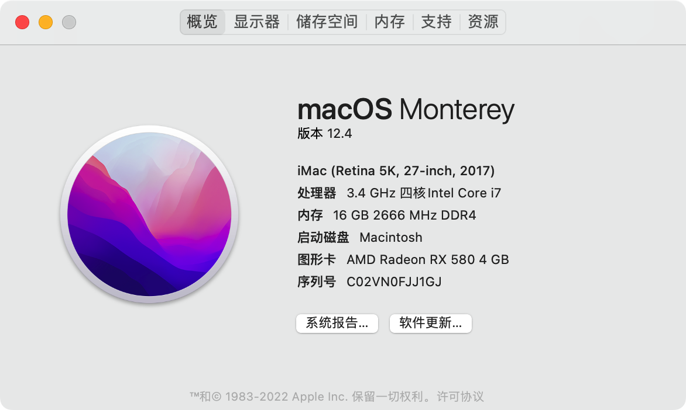
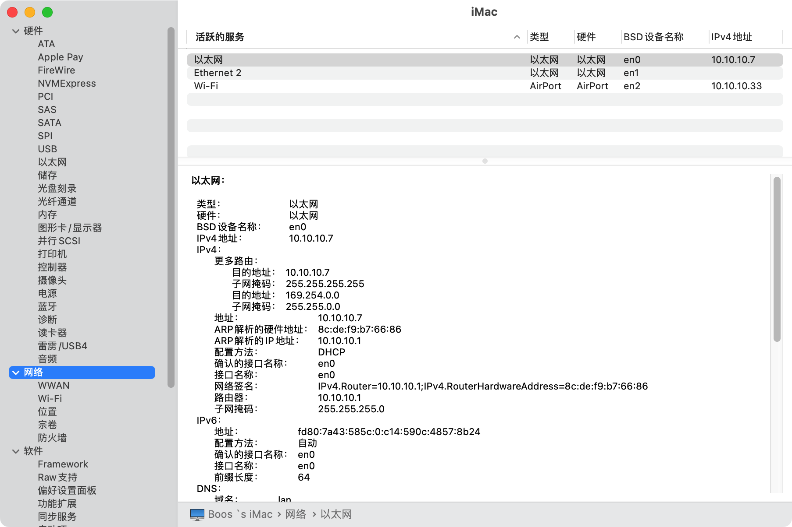
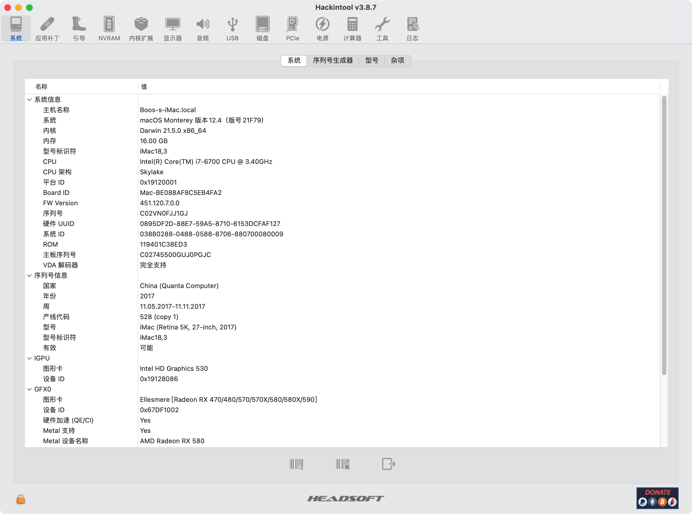
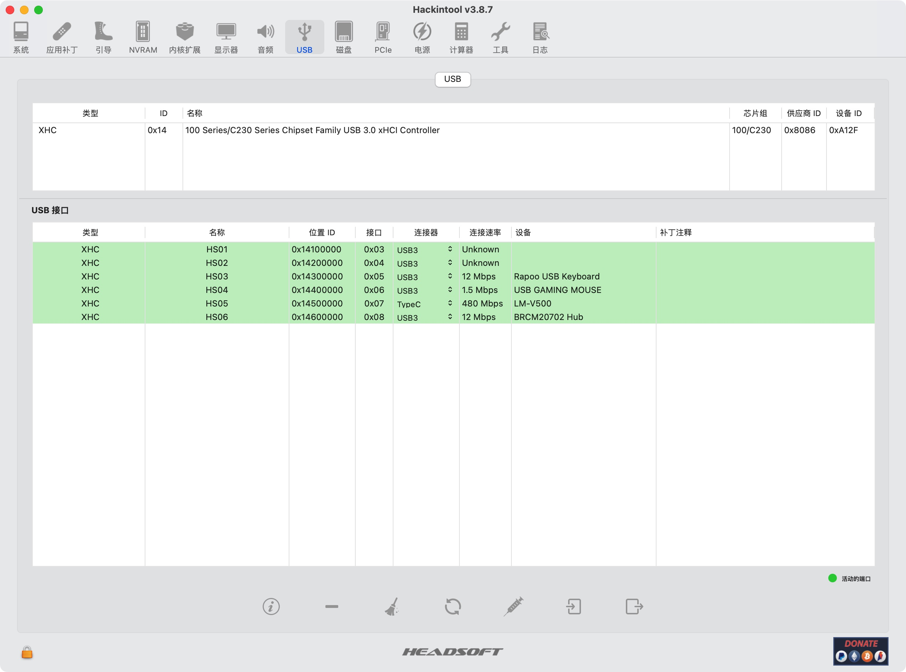

# OpenCore 0.8.3 

|             |                                                              |                               |
| ----------- | ------------------------------------------------------------ | ----------------------------- |
| MotherBoard | GA-Z170N-WIFI                                                | Bios Mod                      |
| CPU         | I7-6700                                                      | 4C8H                          |
| Memory      | ADATA 2666 Mhz                                               | 8G*2                          |
| GPU         | AMD Radeon RX 580 4 GB / Intel HD Graphics 530               | XFX Version / Sapphire vBios  |
| WIFI        | BCM94360CS2                                                  | WIFI 5 1200Mbps / BT 4.0 NGFF |
| Ethernet    | Intel I219V2                                                 | 1G / IntelMausi               |
| Disk        | KINGSTON SV300S37A120G / WDC WDS240G1G0B-00RC30 / WDC WD10EZEX-75WN4A0 | Disable **TRIM**              |

